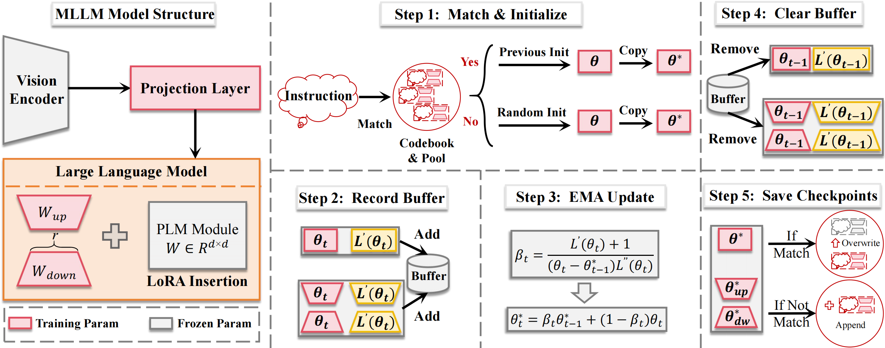

# **Large Continual Instruction Assistant**

**Jingyang Qiao,** **Zhizhong Zhang,** **Xin Tan,** **Yanyun Qu,** **Shouhong Ding,** **Yuan Xie†**

1 East China Normal University 2 Shanghai Innovation Institute 3 Xiamen University 4 Tencent Youtu Lab

Official Pytorch implementation for ICML 2025 paper "**Large Continual Instruction Assistant**"

## Abstract

Continual Instruction Tuning (CIT) is adopted to continually instruct Large Models to follow human intent data by data. It is observed that existing gradient update would heavily destroy the performance on previous datasets during CIT process. Instead, Exponential Moving Average (EMA), owns the ability to trace previous parameters, which can aid in decreasing forgetting. Nonetheless, its stable balance weight fails to deal with the ever-changing datasets, leading to the out-of-balance between plasticity and stability. In this paper, we propose a general continual instruction tuning framework to address the challenge. Starting from the trade-off prerequisite and EMA update, we propose the plasticity and stability ideal condition. Based on Taylor expansion in the loss function, we find the optimal balance weight can be automatically determined by the gradients and learned parameters. Therefore, we propose a stable-plasticity balanced coefficient to avoid knowledge confusion. Based on the semantic similarity of the instructions, we can determine whether to retrain or expand the training parameters and allocate the most suitable parameters for the testing instances. Extensive experiments across multiple continual instruction tuning benchmarks demonstrate that our approach not only enhances anti-forgetting capabilities but also significantly improves overall continual tuning performance.



**Paper is available at** https://arxiv.org/abs/2410.10868.

## Install Repository
1. Clone this repository
``` 
git clone https://github.com/JingyangQiao/LCIA.git
cd CoIN 
```
2. Install Package
```
conda env create -f llava.yaml
```

3. Conda activate environment
```
conda activate llava
```

This repo is based on [CoIN](https://github.com/zackschen/CoIN). 

## Dataset Preparation
1. Please download the following datasets: ScienceQA, COCO, VizWiz, TextVQA, GQA, OCR-VQA, ImageNet.

|  Dataset  | Download Path  |
|  :----:  | :----:  |
| COCO | [train2014](http://images.cocodataset.org/zips/train2014.zip), [test2015](http://images.cocodataset.org/zips/test2015.zip), [val2014](http://images.cocodataset.org/zips/val2014.zip) |
| ImageNet  | [images](https://image-net.org/challenges/LSVRC/index.php) |
| OCR-VQA  | [images](https://drive.google.com/drive/folders/1_GYPY5UkUy7HIcR0zq3ZCFgeZN7BAfm_) |
| GQA  | [images](https://downloads.cs.stanford.edu/nlp/data/gqa/images.zip) |
| TextVQA  | [train](https://dl.fbaipublicfiles.com/textvqa/images/train_val_images.zip),[test](https://dl.fbaipublicfiles.com/textvqa/images/test_images.zip) |
| ScienceQA  | [images](https://drive.google.com/drive/folders/1w8imCXWYn2LxajmGeGH_g5DaL2rabHev) |
| VizWiz  | [train](https://vizwiz.cs.colorado.edu/VizWiz_final/images/train.zip), [val](https://vizwiz.cs.colorado.edu/VizWiz_final/images/val.zip), [test](https://vizwiz.cs.colorado.edu/VizWiz_final/images/test.zip) |

After downloading all of them, organize the data as follows:

```
├── cl_dataset
|   └── COCO2014
|    	└── train2014
|		└── val2014
|		└── test2015
|   └── GQA
|    	└── images
|    	└── testdev_balanced_questions.json
|   └── ImageNet_withlabel
|    	└── train
|    	└── val
|    	└── test
| 	└── OCR-VQA
|    	└── images
|	└── ScienceQA
|		└── images
|		└── pid_splits.json
|		└── problems.json
|	└── TextVQA
|    	└── train_images
|    	└── test_images
|    	└── TextVQA_0.5.1_val.json
|   └── VizWiz
|    	└── train
|    	└── val
|    	└── test
```

2. Please download the corresponding instruction annotations of each dataset at: [CoIN_Refined](https://huggingface.co/datasets/jingyang/CoIN_Refined).

   then, organize the instructions as follows:

```
├── playground
├── Instructions(Origin, The parentheses represent comments)
│   └── ScienceQA
│       └── train.json
│       └── test.json
|	└── ...
├── Instructions_type2(Diverse,The parentheses represent comments)
│   └── ScienceQA
│       └── train.json
│       └── test.json
|	└── ...
├── Instruction_type3(10Type, The parentheses represent comments)
│   └── ScienceQA
│       └── train.json
│       └── test.json
|	└── ...
```

## Pre-trained Checkpoints Preparation
Please download the pretrained LLaVA in [LLaVA Model_Zoo](https://github.com/haotian-liu/LLaVA/blob/main/docs/MODEL_ZOO.md).

then, organize the instructions as follows:

```
├── checkpoints
|   └── openai
│   	└── clip-vit-large-patch14-336
|	└── Vicuna
|		└── vicuna-7b-v1.5
|		└── vicuna-13b-v1.5
|	└── Instruction
|		└── Only_Pretrain_1.5_7b
|			└── llava-vicuna-2-7b-chat-pretrain
|				└── mm_projector.bin
|		└── Only_Pretrain_1.5_13b
|			└── llava-vicuna-2-13b-chat-pretrain
|				└── mm_projector.bin
```

**Tips: mm_projector.bin usually in the downloaded vicuna-7b-v1.5/vicuna-13b-v1.5 folder.** 

## Continual Tuning

We provide the scripts of our origin continual train order in `scripts/CoIN/Train_CIA`.
You can run the training demo by:

```
CUDA_VISIBLE_DEVICES=0,1,2,3,4,5,6,7 bash ./scripts/CoIN/Train_CIA/Train_all.sh
```

The saved checkpoints will in:

```
./checkpoints/Instruction/Only_Pretrain_1.5_CIA
```

## Evaluation
We have prepared the scripts to evaluate the trained model in `scripts/CoIN/Eval`.

You can run the evaluation demo by:

```
CUDA_VISIBLE_DEVICES=0,1,2,3,4,5,6,7 bash ./scripts/CoIN/Eval/eval_all.sh
```

The evaluation results will in:

```
./results/CoIN
```

## Notice
1. The core data of dynamic EMA update is in ./CoIN/peft/tuners/lora.py.
2. The core data of instruction grouping is in ./instruct/LoRASelect.py.
3. Considering that all the core data (LLaVA version) has been published and it is easily transferred to other MLLMs or LLMs, we will postpone the deployment of our method on other models.

## ToDO

1. Update Diverse training and evaluation scripts
2. Update 10Type training and evaluation scripts

## License

This repository is released under the MIT license.

## Citation

```
@inproceedings{qiao2025LCIA,
  title={Large Continual Instruction Assistant},
  author={Qiao, Jingyang and Zhang, Zhizhong and Tan, Xin and Qu, Yanyun and Ding, Shouhong and Xie, Yuan},
  booktitle={International conference on machine learning},
  year={2025}
}
```

## Acknowledgement
[CoIN](https://github.com/zackschen/CoIN): the codebase we built upon.
